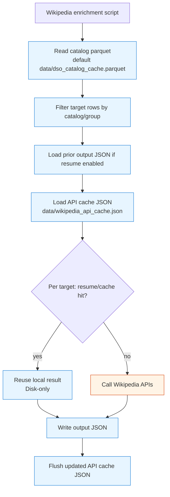

# Catalog Dataflow (Disk vs Network)

This document describes how catalog loading/build works in this repo and when it uses only local files versus external network calls.

## 1) App Catalog Load Dataflow

```mermaid
flowchart TD
    A["App startup or refresh\nCatalog load"] --> B{Loader mode}

    B -->|curated_parquet| C[Read data/dso_catalog_curated.parquet]
    C --> COK{Valid parquet + schema?}
    COK -->|yes| CEND[[Return catalog\nDisk-only]]
    COK -->|no| L

    B -->|legacy default| L[Legacy unified loader]

    L --> D{Can reuse cache?\nall true:\n- not force_refresh\n- cache file exists and is readable}
    D -->|yes| E[Read data/dso_catalog_cache.parquet + metadata]
    E --> EEND[[Return catalog\nDisk-only]]

    D -->|no| F{Does data/DSO_CATALOG_ENRICHED.CSV exist?}

    F -->|yes| G[Read enriched CSV]
    G --> H{Old parquet exists?}
    H -->|yes| I[Read old parquet and append cache-only IDs\n(no overwrite of enriched IDs)]
    H -->|no| J[Use enriched rows as base]
    I --> K
    J --> K

    F -->|no| O[Fetch OpenNGC CSV]
    O --> P{OpenNGC success?}
    P -->|yes| Q[Use OpenNGC rows]
    P -->|no| R[Read data/dso_catalog_seed.csv fallback]
    Q --> K
    R --> K

    K[Attempt SIMBAD named-object ingest\n(merge + M/NGC enrichment)] --> S[Normalize + type mapping/grouping]
    S --> T[Write data/dso_catalog_cache.parquet]
    T --> U[Write data/dso_catalog_cache_meta.json]
    U --> V[[Return rebuilt catalog]]

    classDef disk fill:#e7f5ff,stroke:#1c7ed6,stroke-width:1px;
    classDef net fill:#fff4e6,stroke:#d9480f,stroke-width:1px;

    class C,E,G,I,J,R,T,U disk;
    class O,K net;
```

## 2) Exactly When We Are Disk-Only

Disk-only catalog loads happen when either:

- `curated_parquet` mode succeeds reading `data/dso_catalog_curated.parquet`, or
- `legacy` mode decides cache is reusable and returns `data/dso_catalog_cache.parquet`.

In both cases, no catalog-source network fetches are attempted.

Deployment intent:

- `data/dso_catalog_cache.parquet` is treated as a shipped app artifact.
- Refresh/replacement is on-demand (manual refresh/CLI), not time-based.

## 3) Exactly When Network Calls Happen

Network calls happen when a rebuild is needed (cache not reusable or forced refresh):

- OpenNGC HTTP fetch is attempted only when enriched CSV path is unavailable/disabled/fails.
- SIMBAD TAP fetch is attempted during rebuild (after base frame selection).

Typical triggers for rebuild:

- Settings button `Refresh catalog cache` (sets `force_refresh=True`).
- Running `python scripts/ingest_catalog.py` (always `force_refresh=True`).
- Cache file is missing.
- Cache file exists but cannot be read/normalized.

## 4) Wikipedia Enrichment Script (from cached parquet)



## 5) Key Files

- Loader entry: `app.py`
- Loader orchestration: `dso_enricher/catalog_service.py`
- Ingest/cache logic: `dso_enricher/catalog_ingestion.py`
- Force-rebuild CLI: `scripts/ingest_catalog.py`
- Wikipedia enrichment (reads parquet, optionally calls web): `scripts/build_wikipedia_catalog_enrichment.py`
